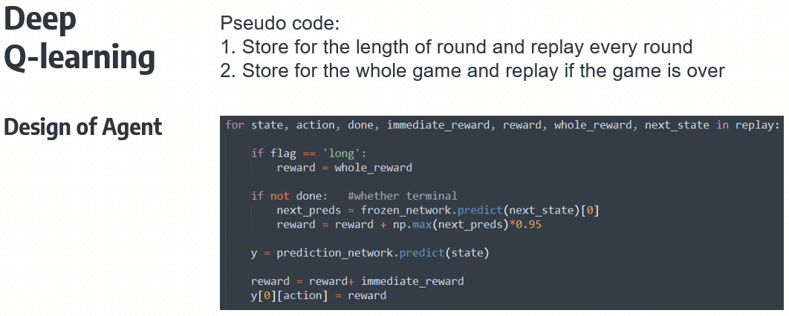
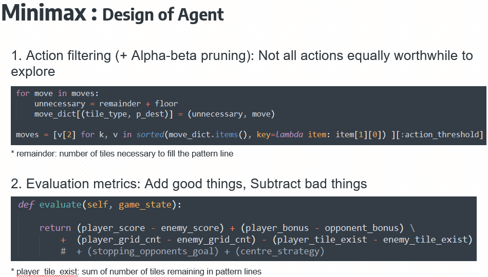

# AZUL game AI-agent competition
COMP90054 (AI planning for Autonomy) In-class competition: Creating AI agents for Azul game

Video demo is available [here](https://youtu.be/vctpCTW8iWU) and project information is in [project-info.md](https://github.com/kaiyoo/AI-azul/blob/master/project-info.md)

## [1] Overview
This project was done as the final project of a subject (COMP90054 - AI planning for autonomy). 

Ranked 12th out of 68 teams. 

Our team implemented 3 algorithms: 1) Monte Carlo Tree Search, 2) Deep Q-learning, 3) Minimax.

Among above algorithms, I implemented both DQN and Minimax.

For our final agent, **Minimax** player was chosen. 

## [2] DQN (Deep Q-learning)
> **Naive player** (player0-top)  **vs**  **DQN player** (player1-bottom) : DQN won! (23-24)
> 
> **In the demo**, player0 (top) is naive player (baseline - simple strategy) and **player1 (bottom) is DQN player**.
> 
> At the end of the game, DQN player beated naive player only by 1 point (23-24), which is not powerful... It was possibly because the state space for action is too large. Maybe it could end up with the better result if forcing a bad reward for unnecessary (totally meaningless) actions for some initial replay periods like in "unnecessary action filtering" in Minimax (see Design of Agent).
> 
> Implementation of model training for DQN player is in [dqn_train_model.py](dqn_train_model.py) and implementation of DQN player is in [/Alpha_Azul_20/dqn_player.py](players/Alpha_Azul_20/dqn_player.py)
> 

## [3] Minimax
> **Naive player** (player0-top)  **vs**  **Minimax player** (player1-bottom) : Minimax won! **(16-32)**
> 
> **In the demo**, player0 (top) is naive player (baseline - simple strategy) and **player1 (bottom) is Minimax player**.
> 
> At the end of the game, our Minimax player beated naive player **by double (16-32)**, which is very powerful.
> 
> Look at the **Design of the Agent**. Since the state space for action is too large, **"Action filtering"** as well as alpha-beta pruning was used to filter unnecessary (totally meaningless) actions while making the agent **being able to explore deeper with smaller action state space**.
> 
> In addition, many other strateges were considered in **evaluation metrics to maximize the gap in points** earned between enemy and my player (see my code below).
> 
> Implementation of Minimax player is in [/Alpha_Azul_20/minimax_player.py](players/Alpha_Azul_20/minimax_player.py)
> 

